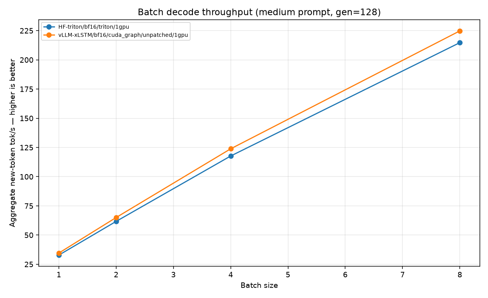
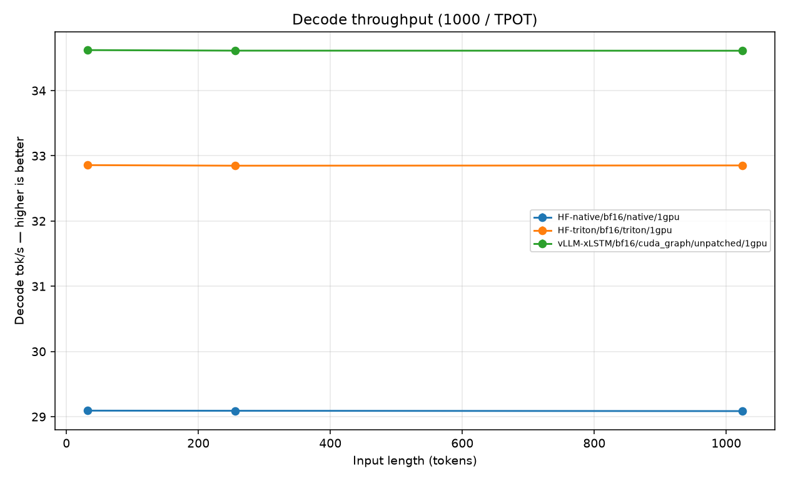
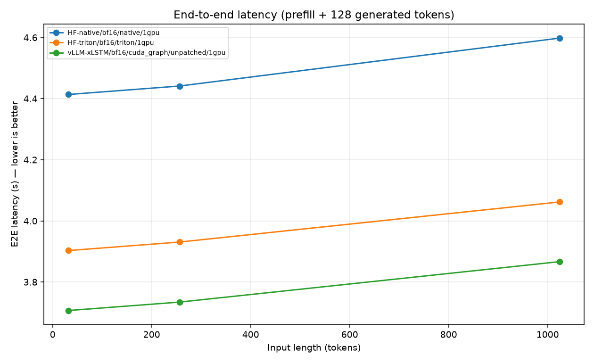
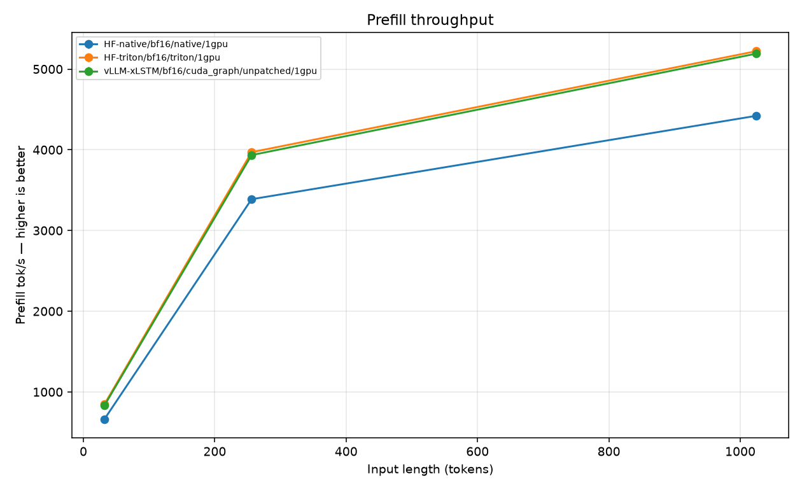
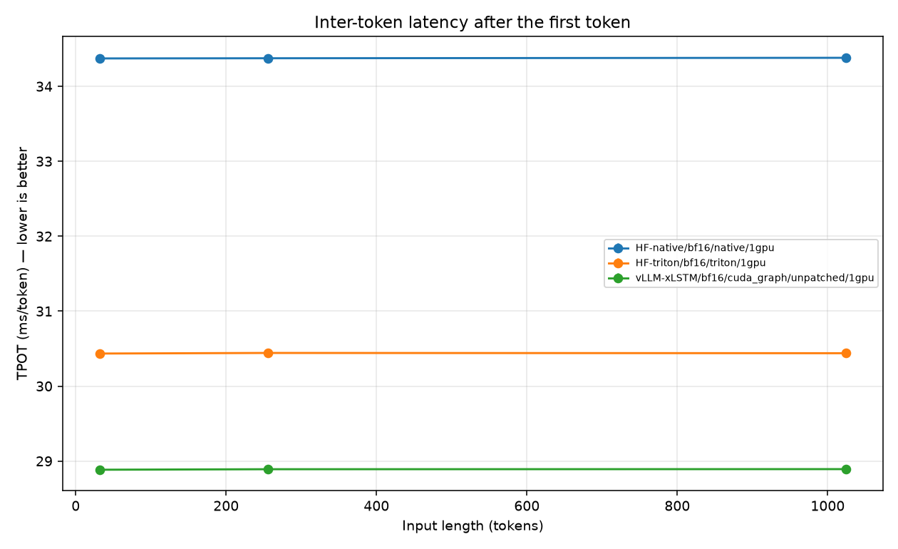
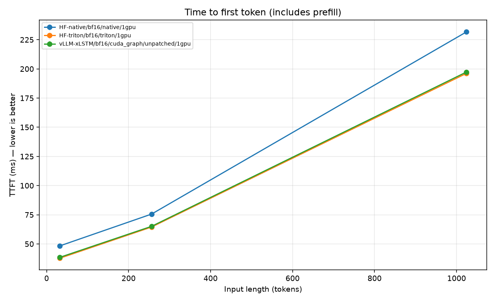

# vllm-xlstm

Out-of-tree [vLLM](https://github.com/vllm-project/vllm) **plugin** and CUDA-graph
inference engine for [NX-AI/xLSTM-7b](https://huggingface.co/NX-AI/xLSTM-7b).

This is **not** a vLLM core PR and **not** part of NX-AI/xLSTM.
## Status

This repo is an **out-of-tree vLLM plugin plus a CUDA-graph inference engine**.

- `pip install -e .` registers `xLSTMForCausalLM` via `vllm.general_plugins`.
- The speed path that beat Hugging Face is `GraphDecodeEngine`: HF weights +
`mlstm_kernels` + PyTorch CUDA graphs. It does **not** go through `vllm.LLM`.
- Full `vllm serve NX-AI/xLSTM-7b` / `LLM(model="NX-AI/xLSTM-7b")` is **WIP**.
The plugin class is a skeleton.

Results (1× NVIDIA A40, bf16, greedy, gen=128, medium prompt):


| backend                  | decode tok/s | TTFT ms | TPOT ms |
| ------------------------ | ------------ | ------- | ------- |
| HF-native                | 29.10        | 75.5    | 34.36   |
| HF-triton                | 32.87        | 65.1    | 30.43   |
| vLLM-xLSTM (CUDA graphs) | **34.64**    | 64.9    | 28.87   |


Greedy 16-token ids match **HF-triton**, not HF-native (kernel numerics).

Some of the visualised results (1× A40, from `artifacts/runs/20260817_221132_vllm-speed`):














## Weights are not in git

~14 GiB of safetensors stay on the Hub. Download once:

```bash
huggingface-cli download NX-AI/xLSTM-7b
```

Those weights (and `xlstm` / `mlstm_kernels`) use the **NXAI Community License**.
This repo’s code is **Apache-2.0**. See [LICENSE](LICENSE) and [NOTICE](NOTICE).
Built with technology from NXAI.

## Install

Needs Python ≥ 3.11, CUDA, and [uv](https://docs.astral.sh/uv/).

```bash
git clone https://github.com/incrementaliser/vllm-xlstm.git
cd vllm-xlstm
uv venv
source .venv/bin/activate
uv pip install -r requirements.txt
uv pip install -e .
```

`requirements.txt` pins `torch==2.4.1+cu118`. Change the extra-index URL if you
need another CUDA.

## Reproduce the speed report

Needs a CUDA GPU.

```bash
uv run xlstm-vllm-speed          # 1 GPU
uv run xlstm-vllm-speed-tp2      # 2 GPUs (capacity; not the 1-GPU gate)
cat artifacts/runs/<DATE_TIME_EXPERIMENT>/report.md
# e.g. artifacts/runs/20260817_213700_vllm-speed/report.md  (UTC)
```

Pass `--hf-dir /path/to/snapshot` to skip Hub lookup.

Create bash files depending on your cluster, and run the above on your GPU to reproduce the reported results.

## Layout

```
vllm_xlstm/           # installable package
  plugin/             # vLLM ModelRegistry hook + skeleton model
  graph_engine.py     # CUDA-graph decoder (the measured speed path)
  bench.py            # HF-native / HF-triton / graph engine matrix
data/speed_prompts.json
examples/             # 1-GPU report excerpt + plots
```


## License

Apache-2.0 for this repository’s source. NXAI Community License for `xlstm`,
`mlstm_kernels`, and `NX-AI/xLSTM-7b` weights. See [NOTICE](NOTICE).